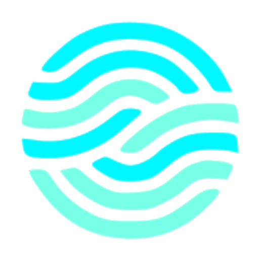
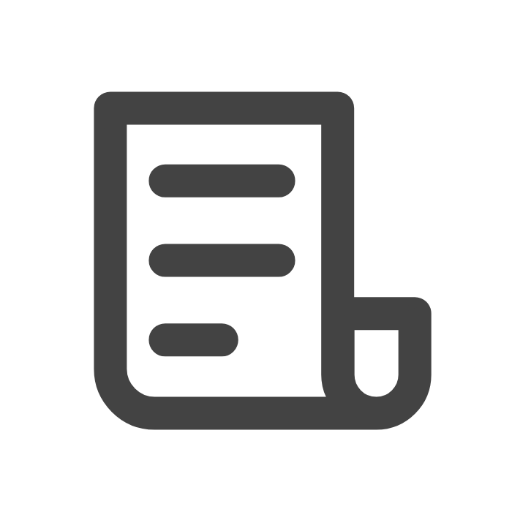

# :man: About me

I am a software engineering at Epitech Lyon in France, I am in my third years of study. I'm open to any opportunity 

# Currently working on
### <a href="https://github.com/leon3108/ecommerce-product-page-main">ecommerce-product-page</a>
showcase site, Build with Html, CSS and ReactJs

    

# Skills

<table align="center">
	<thead>
		<tr>
			<th colspan="2"><b>Software Development</b></th>
			<th colspan="1"><b>Front-end Web</b></th>
			<th colspan="1"><b>Video Games</b></th>
			<th colspan="1"><b>Organization</b></th>
			<th colspan="1"><b>Design</b></th>
			<th colspan="1"><b>Oriented Object Programming</b></th>
			<th colspan="1"><b>Machine Learning</b></th>
		</tr>
	</thead>
	<tbody>
		<tr>
			<td align="center"><a href="https://en.wikipedia.org/wiki/C%2B%2B">C++</a></td>
			<td align="center"><a href="https://en.wikipedia.org/wiki/Haskell">Haskell</a></td>
			<td align="center"><a href="https://en.wikipedia.org/wiki/HTML">HTML</a></td>
			<td align="center"><a href="https://en.wikipedia.org/wiki/C%2B%2B">C++</a></td>
			<td align="center"><a href="https://en.wikipedia.org/wiki/Git">Git</a></td>
			<td align="center"><a href="https://www.canva.com/">Canva</a></td>
			<td align="center"><a href="https://en.wikipedia.org/wiki/C%2B%2B">C++</a></td>
			<td align="center"><a href="https://pytorch.org/">Pytorch</a></td>
		</tr>
		<tr>
			<td align="center"><a href="https://en.wikipedia.org/wiki/C_(programming_language)">C</a></td>
			<td align="center"><a href="https://en.wikipedia.org/wiki/Assembly_language">Assembly</a></td>
			<td align="center"><a href="https://en.wikipedia.org/wiki/CSS">CSS</a></td>
			<td align="center"><a href="https://en.wikipedia.org/wiki/C_(programming_language)">C</a></td>
            <td align="center"><a href="https://www.notion.so/">Notion</a></td>
			<td align="center"><a href="https://www.figma.com/">Figma</a></td>
			<td align="center"><a href="https://en.wikipedia.org/wiki/Delphi_(software)">Delphi</a></td>
			<td align="center"></td>
		</tr>
		<tr>
			<td align="center"><a href="https://cmake.org/">CMake</a></td>
			<td align="center"><a href="https://www.python.org/">Python</a></td>
			<td align="center"><a href="https://reactjs.org/">React</a></td>
			<td align="center"><a href="https://www.sfml-dev.org/">SFML</a></td>
			<td align="center"><a href="https://trello.com">Trello</a></td>
			<td align="center"></td>
			<td align="center"></td>
			<td align="center"></td>
		</tr>
	</tbody>
</table>

# Hackaton with <a href="https://www.starton.io/">Starton</a>

<a href="https://github.com/clement4saunier/FUNDSARESAFE">QuickStarter</a>, may 2021, 3rd place

    
    
A crowd-funding platform entirely decentralized.

<a href="https://github.com/clement4saunier/defacto-dapp">DeFacto</a>, november 2022, 2nd place

    
    
Decentralized platform for incentivized journalism and fact-checking.

# Projects
### <a href="https://github.com/leon3108/ecommerce-product-page-main">ecommerce-product-page</a>

##### Work In Progress

showcase site, Build with Html, CSS and ReactJs

    

# Contact

	
	&nbsp;
	

